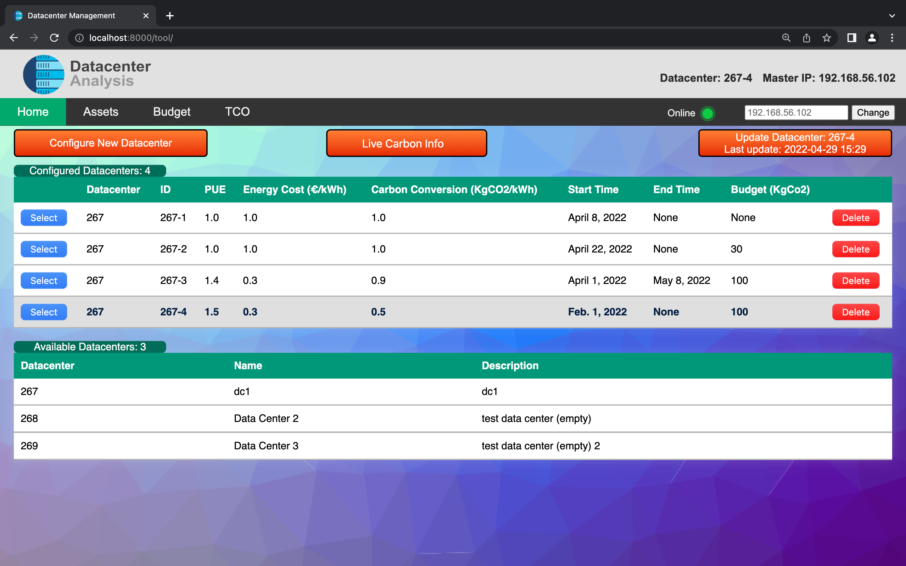
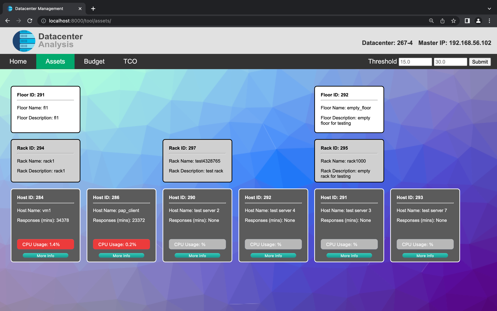
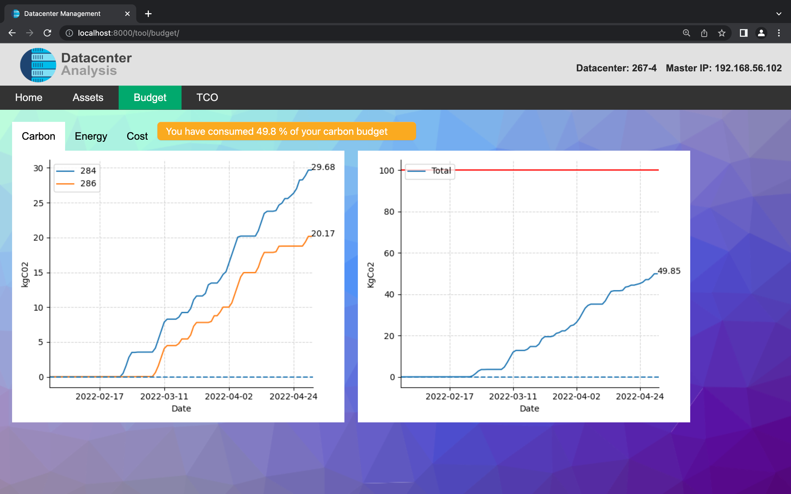
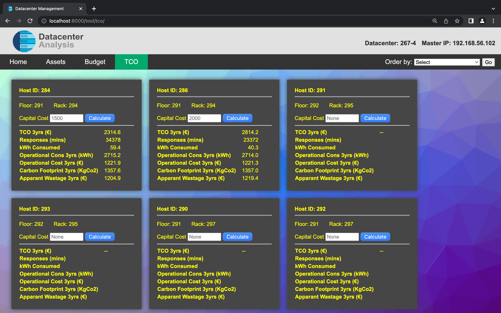

# Repository for UCD COMP30910 

# Datacenter Management Tool

## Student Number: 18339866

---

## Requirements

- [Docker](https://www.docker.com/products/docker-desktop)
- [Python 3.7+](https://www.python.org/downloads/release/python-370/)

---

## 3 minute demonstration
Short demonstration of web application since you need to be on the same network as a datacenter to use any of the features:

https://drive.google.com/file/d/1Ki3sNgRQNWIsZqvzZYCo3Nslu1Wu_WTN/view?usp=sharing

---

### Instructions for running:

Naviagte to the 'webapp' directory 
```
cd webapp
```

There are three different ways to start the web application depending on your use case. 

Using docker:

```
docker compose build
docker compose up
```

Using a virtual environment (If you do not want to use docker):

```
source startup.sh
fab run
```

Debug mode
This will install python libraries globally (not recommended)

```
pip3 install -r requirements.txt
python3 manage.py runserver
```

Web application is now available at http://localhost:8000

---

### Clean Up

```
fab kill
fab reset
```

---

### User Interface





---

### Team 

- [Daniel Houlihan](https://github.com/DanielHoulihan)


